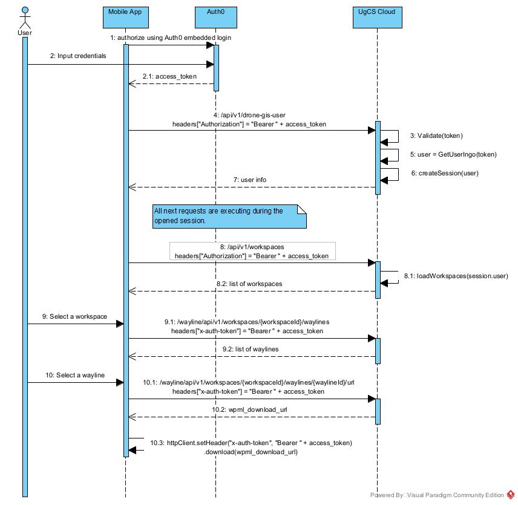

# UgCS Cloud

**Bridge the gap between chief pilots and field teams.**  
Deliver flight plans across your organization, regardless of drone brand.

## Overview

**UgCS Cloud** provides a standardized and secure way to deliver flight plans to both DJI and non-DJI drones. Share and manage flight plans over the internet—directly from UgCS Desktop to DJI Pilot 2 and other mobile apps.

## Features

- **Cloud storage** for organizational flight plans
- **Seamless delivery**: Like Dropbox for drone missions
- **Mixed fleet support**: Works with DJI and non-DJI drones
- **Secure communication** between chief pilot and field teams
- **API for integration**: Connect your mobile drone app to UgCS Cloud
- **User management** and role-based access

## Benefits

- **For end-users**: Effortless, secure access to up-to-date flight plans
- **For drone vendors**: Ready-to-go platform for integration and market expansion
- **For developers**: Simple REST API for flight plan access and delivery

## Getting Started

Visit the [API documentation](https://dev-cloud.ugcs.com/api) for details on connecting your app or controller.

Use the following sequence diagram for the interaction with UgCS Cloud.

## Support

Integration supervision and technical support provided by [SPH Engineering](https://www.sphengineering.com/).
